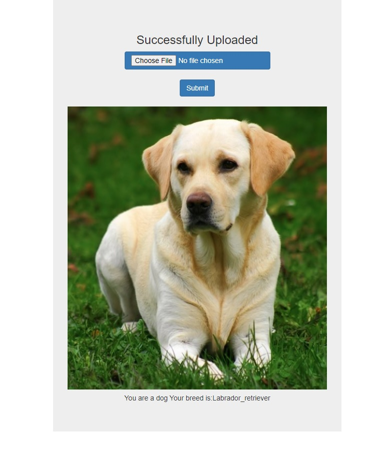
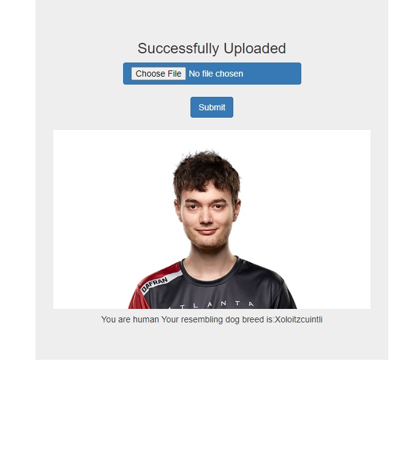

# Dog Identification and Breed Classifier Web App using ResNet50 as pretrained CNN
# Project Motivation/Details
This project implements an algorithm to detect whether a picture contains a human or a dog. Upon detection, it uses a CNN to classify the dog breed in case of a dog picture, otherwise, in case of a human, it returns the closest resemblance to a dog breed. The algorithm accomplishes this task as follows:
1. Using OpenCV's implementation of Haar feature-based cascade classifiers to detect human faces in images, we determine if the picture is that of a human.
2. We use a pre-trained ResNet-50 model to detect dogs in images.
3. In both of the cases above, the image is then passed to the CNN model (that is a pre-trained ResNet50 CNN) to identify which dog breed is a close resemblance to the human or the dog belongs to. In this implementation, we have 133 classes for the dog breeds.

The **Jupyter notebook dog_app.ipynb** (available in the Dog_Breed_Classifier folder both as an html or ipynb file) goes into the details of the coding work involved to accomplish our task. The notebook is delineated as follows:
1. Import Datasets
2. Detect Humans
3. Detect Dogs
4. Create a CNN to Classify Dog Breeds (from Scratch)
5. Use a CNN to Classify Dog Breeds (using Transfer Learning)
6. Create a CNN to Classify Dog Breeds (using Transfer Learning)
7. Write Algorithm
8. Test Algorithm

Finally, we created a simple web app that takes a picture (user uploaded) and predicts as per our algorithm.
**See Screenshots of webapp below:**

## Prompt to Upload a picture:

## Prediction on a Labrador Retriever:

## Prediction on a Car:

## Prediction on a human:

# Installation
Make sure any Python 3.* is installed alongside the pandas, numpy, matplotlib, sklearn , pickle, Plotly, Flask libraries, Tensorflow and OpenCv libraries.

# File Descriptions
The **Dog_Breed_Classifier** folder contains:
1. the "app.py" for the web app.
2. the "dog_app.ipynb" or "dog_appnotebook.html" as the jupyter notebook containing all details for the project
3. the "Resnet50_final"; which is the fully trained CNN network with 133 prediction classes.
4. other folders with images for testing etc...

# Instructions
Run the following in the project's root directory:
1. **python Dog_Breed_Classifier/app.py** ==> to run the web app
2. Follow the instructions and link given in your terminal

# Licensing, Authors, Acknowledgements
Thanks to UDACITY, Kaggle and StackOverflow for providing insight and solution to complications encountered along the way!
